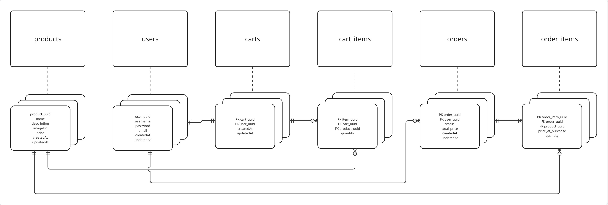

# Online Store

Веб-приложение «Витрина интернет-магазина» на Spring Boot — учебный проект

[](https://github.com/rukonpin/online-store/releases/tag/v1.0)

> 🚧 В данный момент ведется активная разработка версии `v2.0`— переезд на реактивный стек

Пользователи могут просматривать каталог товаров, добавлять их в корзину и оформлять заказы, просматривать историю 
заказов. Поддерживается 
регистрация, вход и сессионная авторизация.

## Showcase

> 📹 **Видео-демонстрация проекта:**

[](https://youtu.be/nLFn27XQWGs)

## Стек технологий

| Слой              | Технология                              |
|-------------------|-----------------------------------------|
| Backend           | Java 21, Spring Boot 3                 |
| Web               | Spring Web MVC, Thymeleaf              |
| БД                | PostgreSQL 15, Spring Data JPA, Hibernate |
| Маппинг           | MapStruct                              |
| Тесты             | JUnit 5, Mockito, Spring Boot Test, MockMvc |
| Сборка            | Maven                                  |
| Контейнеризация   | Docker, Docker Compose                 |

## Схема базы данных




## Структура проекта

```
src/
├── main/
│   ├── java/com/online/store/
│   │   ├── controller/
│   │   │   ├── cart/        # CartRestController, CartViewController
│   │   │   ├── order/       # OrderRestController, OrderViewController
│   │   │   ├── product/     # ProductRestController, ProductViewController
│   │   │   └── user/        # UserRestController, UserViewController
│   │   ├── dto/             # CartDto, OrderDto, ProductDto, UserDto
│   │   ├── exception/       # GlobalExceptionHandler + кастомные исключения
│   │   ├── mapper/          # MapStruct: CartMapper, OrderMapper, ProductMapper, UserMapper
│   │   ├── model/           # JPA-сущности: Cart, CartItem, Order, OrderItem, Product, User
│   │   ├── repository/      # Spring Data JPA репозитории
│   │   ├── service/         # Интерфейсы и реализации сервисов
│   │   └── StoreApplication.java
│   └── resources/
│       ├── static/          # CSS, JS, иконки
│       ├── templates/       # Thymeleaf-шаблоны
│       ├── application.yaml
│       ├── application-dev.yaml
│       └── application-test.yaml
└── test/
    └── java/com/online/store/
        ├── controller/      # WebMvcTest тесты
        └── service/         # Unit-тесты сервисов
```

## Запуск

### Требования

- Java 21+
- Maven 3.9+
- Docker и Docker Compose (для запуска в контейнере)
- PostgreSQL 15 (для локального запуска без Docker)

### 1. Локально в IDE

**Шаг 1.** Клонируй репозиторий:

```bash
git clone https://github.com/rukonpin/online-store.git
cd online-store
```

**Шаг 2.** Запусти PostgreSQL через Docker Compose (только БД):

```bash
docker compose -f docker-compose-dev.yml up -d
```

**Шаг 3.** Запусти приложение с профилем `dev`:

```bash
mvn spring-boot:run -Dspring-boot.run.profiles=dev
```

Приложение будет доступно по адресу: [http://localhost:8080/products](http://localhost:8080/products)

### 2. Сборка и запуск JAR

```bash
# Сборка
mvn clean package -DskipTests

# Запуск (предварительно должна быть запущена БД)
java -jar target/*.jar --spring.profiles.active=dev
```

### 3. Запуск в Docker (полный стек)

Запускает и приложение, и базу данных одной командой:

```bash
docker compose up --build
```

Приложение доступно по адресу: [http://localhost:8080/products](http://localhost:8080/products)

Остановка:

```bash
docker compose down
```

Остановка с удалением данных БД:

```bash
docker compose down -v
```

## Тесты

Покрытие тестами: **79%**

Тесты запускаются без внешних зависимостей — используется in-memory конфигурация из `application-test.yaml`.

```bash
mvn test
```

Что покрыто:

- **Unit-тесты сервисов** — `CartServiceImplTest`, `OrderServiceImplTest`, `ProductServiceImplTest`, `UserServiceImplTest`
- **WebMvcTest контроллеров** — `CartRestControllerTest`, `OrderRestControllerTest`, `ProductRestControllerTest`, `UserRestControllerTest`, `ProductViewControllerTest`

## API

### Авторизация

| Метод | Путь                  | Описание              |
|-------|-----------------------|-----------------------|
| POST  | `/api/auth/register`  | Регистрация           |
| POST  | `/api/auth/login`     | Вход (создаёт сессию) |
| POST  | `/api/auth/logout`    | Выход                 |

### Товары

| Метод | Путь                  | Описание                        |
|-------|-----------------------|---------------------------------|
| GET   | `/api/products`       | Список товаров (поиск, пагинация)|
| GET   | `/api/products/{uuid}`| Товар по UUID                   |

### Корзина

| Метод  | Путь                        | Описание                    |
|--------|-----------------------------|-----------------------------|
| GET    | `/api/cart`                 | Получить корзину            |
| POST   | `/api/cart/items`           | Добавить товар              |
| PUT    | `/api/cart/items/{itemUuid}`| Изменить количество         |
| DELETE | `/api/cart/items/{itemUuid}`| Удалить позицию             |
| DELETE | `/api/cart`                 | Очистить корзину            |

### Заказы

| Метод | Путь                   | Описание              |
|-------|------------------------|-----------------------|
| POST  | `/api/orders`          | Оформить заказ        |
| GET   | `/api/orders/{orderUuid}`   | Получить заказ по UUID|

