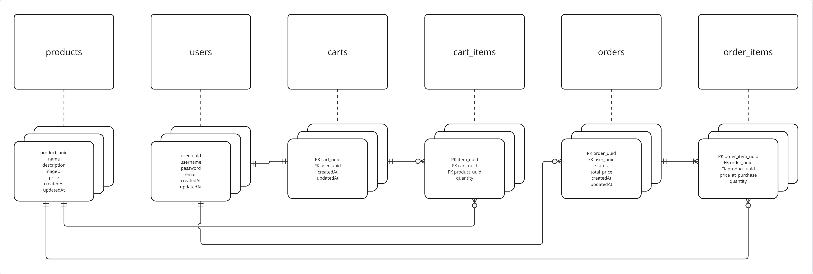

# Online Store

Веб-приложение «Витрина интернет-магазина» на Spring Boot — учебный проект

[](https://github.com/rukonpin/online-store/releases/tag/v1.0)
[](https://github.com/rukonpin/online-store/releases/tag/v2.0)
[](https://github.com/rukonpin/online-store/releases/tag/v3.0)

> ⚡ Приложение полностью переведено на реактивный стек: Spring WebFlux + Spring Data R2DBC
>
> 🧩 Проект переведён на мультимодульную сборку Maven: `store-app` (витрина) + `payment-service` (сервис платежей), интеграция между ними построена на OpenAPI-контракте
>
> 🗄️ Каталог товаров кешируется в Redis (реактивный `ReactiveRedisTemplate`)

Пользователи могут просматривать каталог товаров, добавлять их в корзину и оформлять заказы, просматривать историю
заказов. Поддерживается регистрация, вход и сессионная авторизация. Оформление заказа проверяет баланс пользователя
через отдельный сервис платежей и списывает с него сумму заказа.

## Showcase

> 📹 **Видео-демонстрация проекта:**

[](https://youtu.be/nLFn27XQWGs)

## Стек технологий

| Слой              | Технология                                             |
|-------------------|---------------------------------------------------------|
| Backend           | Java 21, Spring Boot 3                                  |
| Web               | Spring WebFlux, Thymeleaf                                |
| БД                | PostgreSQL 15, Spring Data R2DBC                          |
| Кеш               | Redis 7, Spring Data Redis (реактивный `ReactiveRedisTemplate`) |
| Сервис платежей   | Spring WebFlux, генерация клиента/сервера по OpenAPI (openapi-generator-maven-plugin) |
| Маппинг           | MapStruct                                                |
| Тесты             | JUnit 5, Mockito, Reactor Test (StepVerifier), Spring Boot Test, WebFluxTest, Testcontainers |
| Сборка            | Maven (мультимодульный проект)                           |
| Контейнеризация   | Docker, Docker Compose                                   |


## Схема базы данных




## Структура проекта

Проект — мультимодульная сборка Maven из двух подпроектов и общей папки с OpenAPI-контрактами:

```
online-store/
├── contracts/
│   └── payment-api.yaml               # OpenAPI-спецификация сервиса платежей
├── store-app/                         # основное веб-приложение «Витрина интернет-магазина»
│   ├── src/
│   │   ├── main/
│   │   │   ├── java/com/online/store/
│   │   │   │   ├── config/
│   │   │   │   │   ├── R2dbcConfig.java          # @EnableR2dbcAuditing
│   │   │   │   │   ├── WebFluxConfig.java        # реактивный резолвер Pageable
│   │   │   │   │   ├── RedisConfig.java          # ReactiveRedisTemplate для кеша товаров
│   │   │   │   │   └── PaymentClientConfig.java  # WebClient/ApiClient для payment-service
│   │   │   │   ├── controller/
│   │   │   │   │   ├── cart/
│   │   │   │   │   │   ├── api/     # CartRestController
│   │   │   │   │   │   └── web/     # CartViewController
│   │   │   │   │   ├── order/
│   │   │   │   │   │   ├── api/     # OrderRestController
│   │   │   │   │   │   └── web/     # OrderViewController
│   │   │   │   │   ├── payment/
│   │   │   │   │   │   └── api/     # PaymentRestController (баланс для фронтенда)
│   │   │   │   │   ├── product/
│   │   │   │   │   │   ├── api/     # ProductRestController
│   │   │   │   │   │   └── web/     # ProductViewController
│   │   │   │   │   └── user/
│   │   │   │   │       ├── api/     # UserRestController
│   │   │   │   │       └── web/     # UserViewController
│   │   │   │   ├── dto/
│   │   │   │   │   ├── cart/        # CartDto, CartItemDto, UpdateItemQuantityDto
│   │   │   │   │   ├── order/       # OrderDto, OrderItemDto
│   │   │   │   │   ├── product/     # ProductDto
│   │   │   │   │   └── user/        # UserLoginDto, UserRegistrationDto
│   │   │   │   ├── exception/
│   │   │   │   │   ├── GlobalExceptionHandler.java
│   │   │   │   │   ├── ValidationException.java
│   │   │   │   │   └── cart/, order/, payment/, product/, user/   # кастомные исключения
│   │   │   │   ├── mapper/          # MapStruct: CartMapper, OrderMapper, ProductMapper, UserMapper
│   │   │   │   ├── model/
│   │   │   │   │   ├── ErrorResponse.java
│   │   │   │   │   ├── product/     # Product, ProductCacheDto, ProductCardCacheDto (кеш Redis)
│   │   │   │   │   └── user/, order/, cart/   # R2DBC-сущности (Persistable<UUID>)
│   │   │   │   ├── repository/      # ReactiveCrudRepository / R2dbcRepository
│   │   │   │   ├── service/
│   │   │   │   │   ├── cart/, order/, product/, user/   # реактивные сервисы (Mono/Flux)
│   │   │   │   │   └── payment/     # PaymentClientService — клиент к payment-service
│   │   │   │   └── StoreApplication.java
│   │   │   └── resources/
│   │   │       ├── static/          # CSS, JS, иконки
│   │   │       ├── templates/       # Thymeleaf-шаблоны
│   │   │       ├── schema.sql       # DDL таблиц
│   │   │       ├── data-dev.sql     # тестовые данные для dev-профиля
│   │   │       ├── application.yaml
│   │   │       ├── application-dev.yaml
│   │   │       └── application-test.yaml
│   │   └── test/
│   │       └── java/com/online/store/
│   │           ├── BaseIntegrationTest.java     # база для интеграционных тестов (Testcontainers: Postgres + Redis)
│   │           ├── StoreIntegrationTest.java    # E2E: регистрация → вход → корзина → заказ → списание баланса
│   │           ├── controller/       # @WebFluxTest тесты контроллеров
│   │           └── service/          # unit-тесты сервисов (Mockito + StepVerifier), включая кеш Redis
│   └── pom.xml
├── payment-service/                   # RESTful-сервис платежей
│   ├── src/
│   │   ├── main/
│   │   │   ├── java/com/online/store/payment/
│   │   │   │   ├── delegate/         # PaymentApiDelegateImpl — бизнес-логика баланса/списания
│   │   │   │   ├── exception/        # GlobalExceptionHandler, InsufficientFundsException
│   │   │   │   └── PaymentServiceApplication.java
│   │   │   │       # api/ и model/ — генерируются плагином openapi-generator из contracts/payment-api.yaml
│   │   │   └── resources/
│   │   │       └── application.yaml
│   │   └── test/                     # unit- и интеграционные тесты сервиса платежей
│   ├── Dockerfile
│   └── pom.xml
├── docker-compose.yml                 # полный стек: Postgres, Redis, payment-service, store-app
├── docker-compose-dev.yml             # только Postgres + Redis (для локальной разработки)
├── Dockerfile                         # сборка store-app
└── pom.xml                            # родительский agregator-POM (packaging=pom, модули store-app и payment-service)
```


## Запуск

### Требования

- Docker и Docker Compose

Весь стек (PostgreSQL, Redis, сервис платежей и основное приложение) поднимается одной командой, локальная установка Java/Maven/Postgres/Redis не требуется.

### Запуск в Docker (полный стек)

**Шаг 1.** Клонируй репозиторий:

```bash
git clone https://github.com/rukonpin/online-store.git
cd online-store
```

**Шаг 2.** Собери и запусти все сервисы:

```bash
docker compose up --build
```

Поднимутся:
- PostgreSQL — `localhost:5434`
- Redis — `localhost:6379`
- Сервис платежей (`payment-service`) — [http://localhost:8081](http://localhost:8081)
- Основное приложение (`store-app`) — [http://localhost:8080/products](http://localhost:8080/products)

**Остановка:**

```bash
docker compose down
```

**Остановка с удалением данных БД:**

```bash
docker compose down -v
```

## Тесты

Покрытие тестами > 80% бизнес логики, по стате меньше тк просел из-за сгенерированного по OpenAPI

Запуск тестов (требует Docker для Testcontainers):

```bash
mvn test
```

## API

### Авторизация

| Метод | Путь                  | Описание              |
|-------|-----------------------|-----------------------|
| POST  | `/api/auth/register`  | Регистрация           |
| POST  | `/api/auth/login`     | Вход (создаёт сессию) |
| POST  | `/api/auth/logout`    | Выход                 |

### Товары

| Метод | Путь                  | Описание                        |
|-------|-----------------------|---------------------------------|
| GET   | `/api/products`       | Список товаров (поиск, пагинация)|
| GET   | `/api/products/{uuid}`| Товар по UUID                   |

### Корзина

| Метод  | Путь                        | Описание                    |
|--------|-----------------------------|-----------------------------|
| GET    | `/api/cart`                 | Получить корзину            |
| POST   | `/api/cart/items`           | Добавить товар              |
| PUT    | `/api/cart/items/{itemUuid}`| Изменить количество         |
| DELETE | `/api/cart/items/{itemUuid}`| Удалить позицию             |
| DELETE | `/api/cart`                 | Очистить корзину            |

### Заказы

| Метод | Путь                   | Описание              |
|-------|------------------------|-----------------------|
| POST  | `/api/orders`          | Оформить заказ (списывает баланс через сервис платежей) |
| GET   | `/api/orders/{orderUuid}`   | Получить заказ по UUID|

### Платежи (баланс, `store-app` → `payment-service`)

| Метод | Путь            | Описание                                              |
|-------|-----------------|--------------------------------------------------------|
| GET   | `/api/balance`  | Баланс текущего пользователя (`available: false`, если сервис платежей недоступен) |

Сервис платежей (`payment-service`, порт `8081`) реализует контракт `contracts/payment-api.yaml`:

| Метод | Путь                              | Описание                          |
|-------|------------------------------------|------------------------------------|
| GET   | `/payments/{userUuid}/balance`     | Баланс пользователя                |
| POST  | `/payments/charge`                 | Списание суммы заказа с баланса    |